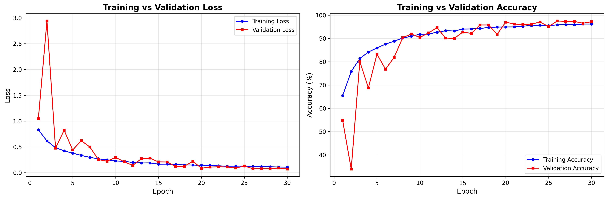
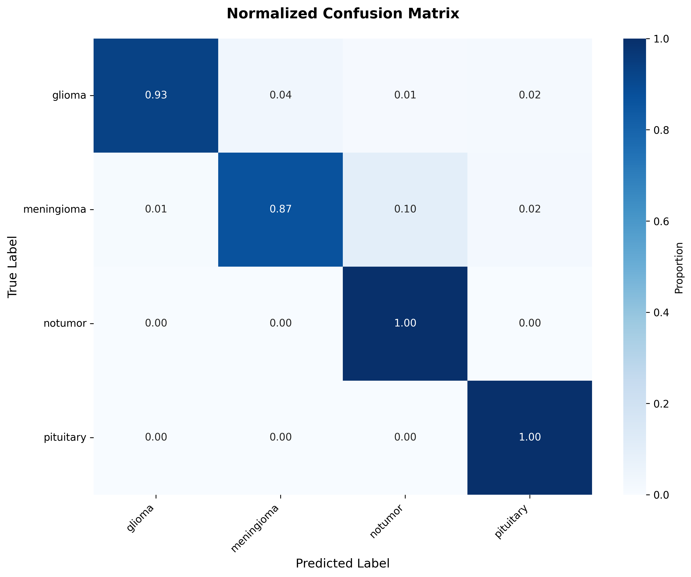

# NeuroVision - Brain Tumor Classification

Classifying brain tumors (Glioma, Meningioma, Pituitary, or No Tumour) from MRI scans using a custom PyTorch CNN.

## Demo Video

[](https://youtu.be/Y5UoI4bWTFo)

## Model Performance





## Quick Start

```bash
npm i && npm run dev
```

## Model Architecture

Custom CNN with:

- 4 convolutional blocks (32→64→128→256 channels)
- Batch normalization and dropout regularization
- Global average pooling
- Fully connected layers (256→512→4 classes)
